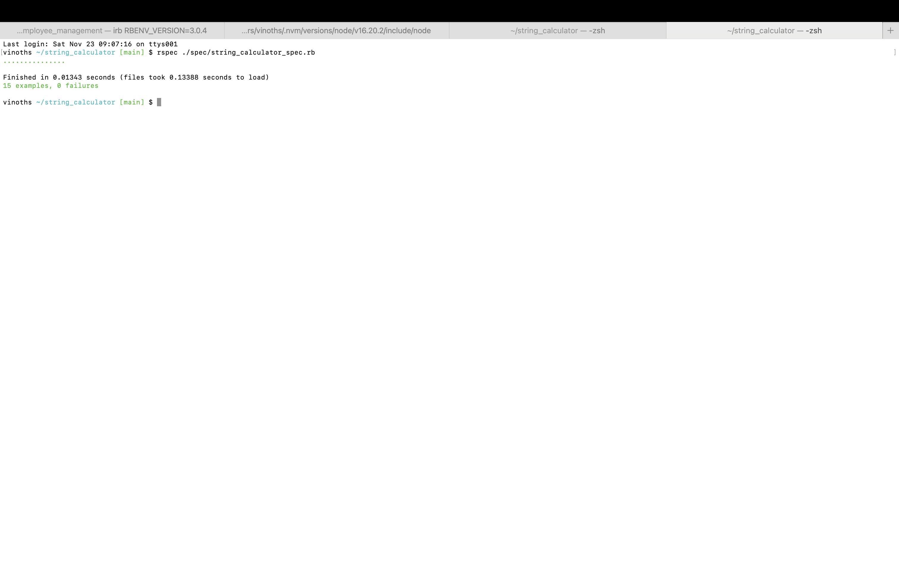

# String Calculator - TDD Kata

Welcome to the **String Calculator TDD Kata** solution! This repository showcases how to build a simple yet flexible `StringCalculator` class using Ruby and adhere to the **Open/Closed Principle** and **Test-Driven Development (TDD)** best practices.

---

## Problem Statement

The **String Calculator** is a utility that performs the following tasks:

1. **Add Numbers**: Adds numbers provided as a comma-separated string.
2. **Custom Delimiters**: Handles user-defined delimiters in single or multiple formats.
3. **Newline Support**: Supports numbers separated by newlines or custom delimiters.
4. **Negative Numbers**: Detects negative numbers and raises an exception, listing all negatives encountered.
5. **Scalability**: Can handle various input formats dynamically without hardcoding logic.

---

## Key Features of the Implementation

### Open/Closed Principle (OCP)
The **Open/Closed Principle** states that a class should be open for extension but closed for modification. Our implementation adheres to this principle by using:

- **Extracted Private Methods**: The `extract_delimiters_and_numbers` and `extract_delimiters` methods allow parsing logic to be extended easily without modifying the main `add` method.
- **Regex for Flexibility**: By using regex to extract custom delimiters and handle complex cases (e.g., multi-character and multiple delimiters), the solution avoids tightly coupled logic.
- **Dynamic Handling**: New input patterns can be added without altering existing logic, ensuring adherence to OCP.

### Test-Driven Development (TDD)
- The implementation is driven by an extensive suite of RSpec tests.
- Each test case ensures the correctness of features incrementally, providing robust test coverage.
- Tests are written to fail first, then pass with minimal implementation, followed by refactoring.

---

## Usage

Clone the repository and run the code in a Ruby environment.

### Installation
1. Clone the repository:
   ```bash
   git clone https://github.com/davidraja17/string_calculator.git
   cd string_calculator
   ```
2. Install dependencies (RSpec):
   ```bash
   gem install rspec
   ```

### Running the Calculator
Use the `StringCalculator` class directly:
```ruby
require 'string_calculator'

calculator = StringCalculator.new
puts calculator.add("//[***]\n1***2***3") # Output: 6
puts calculator.add("1,2,3")              # Output: 6
```

### Running Tests
Run the test suite with:
```bash
rspec
```

---

## RSpec Tests Overview

### 1. Structure of the Tests
- **Context-Based Scenarios**: Each feature is tested within its own context for clarity.
- **Edge Cases**: Extensive tests cover edge cases like empty strings, invalid inputs, and multiple delimiters.

### 2. Example Scenarios Covered
#### Basic Features
- Adding numbers separated by commas or newlines.
- Handling an empty string.

#### Custom Delimiters
- Single-character delimiters: `"//;\n1;2;3"`.
- Multi-character delimiters: `"//[***]\n1***2***3"`.
- Multiple custom delimiters: `"//[*][%]\n1*2%3"`.

#### Negative Numbers
- Throws exceptions listing all negative numbers encountered in the input.

---

## Solution Design

### 1. Dynamic Parsing of Delimiters
- The `extract_delimiters` method identifies delimiters dynamically using regex. 
- Example: Input like `"//[*][%]\n1*2%3"` extracts `["*", "%"]` for splitting.

### 2. Clean Exception Handling
- Negative numbers are handled via an exception:
  ```ruby
  raise "Negative numbers not allowed: -2, -4"
  ```

### 3. Modular Design
The class is designed with modular methods:
- `extract_delimiters_and_numbers`: Parses input into delimiters and the number string.
- `extract_delimiters`: Extracts and normalizes delimiters dynamically.
- `add`: Orchestrates the splitting, validation, and summation.

---

## Code Snippets

### Main Implementation
```ruby
require 'delimiters/delimiter_factory'

class StringCalculator
    def add(input)
      return 0 if input.empty?
  
      delimiters, numbers = extract_delimiters_and_numbers(input)
  
      # Split numbers using the extracted delimiters
      split_numbers = numbers.split(Regexp.union(delimiters))
      integers = split_numbers.map(&:to_i)
  
      # Handle negative numbers
      negatives = integers.select(&:negative?)
      raise "Negative numbers not allowed: #{negatives.join(', ')}" unless negatives.empty?
  
      integers.sum
    end
  
    private
  
    def extract_delimiters_and_numbers(input)
      if input.start_with?("//")
        delimiter_section, numbers = input.split("\n", 2)
        delimiters = extract_delimiters(delimiter_section)
      else
        delimiters = [",", "\n"]
        numbers = input
      end
  
      [delimiters, numbers]
    end
  
    def extract_delimiters(delimiter_section)
      # Remove the leading "//"
      delimiter_section = delimiter_section[2..]
  
      # Handle multiple delimiters (e.g., //[***][%%])
      if delimiter_section.start_with?("[") && delimiter_section.end_with?("]")
        delimiter_section.scan(/\[([^\]]+)\]/).flatten
      else
        [delimiter_section]
      end
    end
  end
```

### Spec Coverage
```ruby
require 'rspec'
require 'string_calculator'

RSpec.describe StringCalculator do
  let(:calculator) { StringCalculator.new }
  
  describe "#add" do

    context "when the input is an empty string" do
        it "returns 0" do
        expect(calculator.add("")).to eq(0)
        end
    end

    context "when the input has a single number" do
        it "returns the number itself" do
          expect(calculator.add("5")).to eq(5)
        end
    end

    context "when the input has two numbers separated by a comma" do
        it "returns the sum of the numbers" do
          expect(calculator.add("1,2")).to eq(3)
        end
    end

    context "when the input has multiple numbers separated by commas" do
        it "returns the sum of all the numbers" do
          expect(calculator.add("1,2,3,4,5")).to eq(15)
        end
    end

    context "when the input has numbers separated by newlines" do
        it "returns the sum of all the numbers" do
          expect(calculator.add("1\n2,3")).to eq(6)
        end
    end

    context "when the input specifies a custom delimiter" do
        it "uses the custom delimiter and returns the sum" do
            expect(calculator.add("//;\n1;2;3")).to eq(6)
          end
    
          it "handles multi-character delimiters" do
            expect(calculator.add("//[***]\n1***2***3")).to eq(6)
          end
    
          it "handles multiple custom delimiters" do
            expect(calculator.add("//[*][%]\n1*2%3")).to eq(6)
          end
    
          it "handles multiple multi-character delimiters" do
            expect(calculator.add("//[**][%%]\n1**2%%3")).to eq(6)
          end
    end

    context "when the input contains negative numbers" do
        it "raises an exception with the negative numbers listed" do
          expect { calculator.add("1,-2,3,-4") }.to raise_error("Negative numbers not allowed: -2, -4")
        end
  
        it "raises an exception for a single negative number" do
          expect { calculator.add("-5") }.to raise_error("Negative numbers not allowed: -5")
        end
    end

    context "when the input contains invalid formats" do
        it "handles edge cases gracefully" do
          expect(calculator.add("1,,2")).to eq(3)
          expect(calculator.add("1\n\n2")).to eq(3)
        end
    end

    context "when no numbers are provided after the custom delimiter declaration" do
        it "returns 0" do
          expect(calculator.add("//;\n")).to eq(0)
        end
    end

    context "when non-numeric values are included" do
        it "ignores non-numeric values and calculates the sum" do
          expect(calculator.add("1,a,3")).to eq(4)
        end
    end

    context "when large input strings are provided" do
        it "handles the input efficiently and returns the correct sum" do
          input = Array.new(1000, 1).join(",") # 1000 numbers of 1
          expect(calculator.add(input)).to eq(1000)
        end
    end

  end
end
```

## Rspec Successful Screenshot

This screenshot shows the successful running of Rspec Coverage:




---

## Why This Solution Stands Out

1. **Readability**: Code and tests are clean, modular, and well-documented.
2. **Scalability**: Easily extendable to handle new requirements without altering existing logic.
3. **Robustness**: Comprehensive test coverage ensures reliability.
4. **Best Practices**: Adheres to TDD and SOLID principles, making the solution professional-grade.

---

## Repository Details
- **Repository URL**: https://github.com/davidraja17/string_calculator.git
- **Author**: David Raja M
